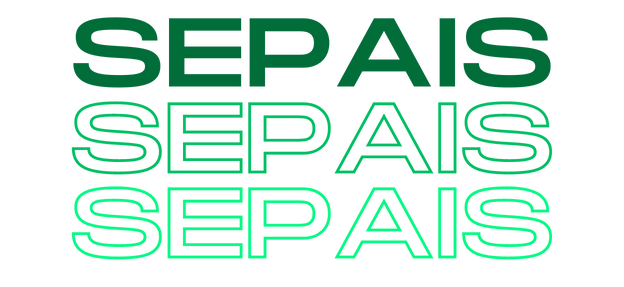

# SEPAIS
 Um sistema de comunicação escolar abrangente - Trabalho de Conclusão de Curso.
 
A ferramenta procura facilitar a comunicação entre a seção pedagógica, os estudantes e seus pais. Além de fornecer um instrumento que gerencie a entrada e saída de alunos.
<h2>Lacuna de pesquisa: </h2>
 <ul>
 <li>Falta de segurança</li>
 <li>Demora para autorização da saída</li>
 <li>Sobrecarga dos servidores da SEPAE e da portaria</li>
 </ul>
<h2>Objetivos específicos</h2>
<ul>
 <li>Criar uma ferramenta que funcione como um canal de comunicação entre a SEPAE e os pais.</li>
 <li>Possibilitar um trabalho mais dinâmico por parte da SEPAE e da PORTARIA</li>
 <li>Elaborar uma função que notifique os pais dos horários da saída dos alunos</li>
 <li>Criar um sistema de controle das faltas justificadas</li>
</ul>
 

 

