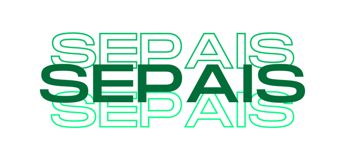

# SEPAIS
Software que visa facilitar as interações entre a Seção Pedagógica de Assuntos Estudantis e os responsáveis dos estudantes, auxiliando em processos como liberação antecipada de alunos e envio de recados.
<h2>Objetivos específicos</h2>
 <ul>
 <li>Modelar um banco de dados para armazenamento de informações do sistema de comunicação digital</li>
 <li>Criar uma interface que possa auxiliar na liberação dos alunos, caso sejam liberados antes do horário regular</li>
 <li>Elaborar uma função que notifique — em caso de liberação antecipada — o horário da saída dos estudantes para os seus responsáveis cadastrados</li>
  <li>Criar uma interface que permita aos responsáveis justificar a saída antecipada de seu(s) dependente(s)</li>
 </ul>

 

 

 

